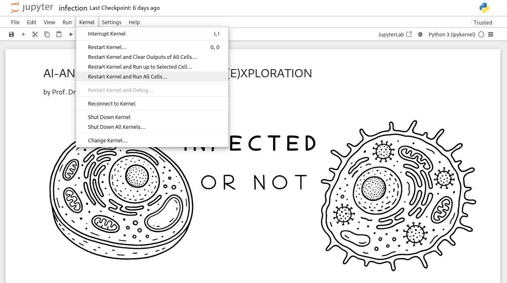

# AI-ANNE (DEMO)
This demo of (A) (N)eural (N)et for (E)xploration shows how students can measure data in order to chart the difference between cows and rabbits, young and old voices or healthy and infected cells and provide the according data to a neural network and specify the learning behavior of the neural network.

# Author
Prof. Dr. habil. Dennis Klinkhammer

# Anleitung
Zu jedem Anwendungsbeispiel stehen Handouts für die Teilnehmerinnen und Teilnehmer sowie Jupyter Notebooks (.ipypn) bereit. Das entsprechende Jupyter Notebook einfach über einen Doppelklick aufrufen und alle Zellen ausführen lassen (*Restart Kernel and Run All Cells...*), fertig!

